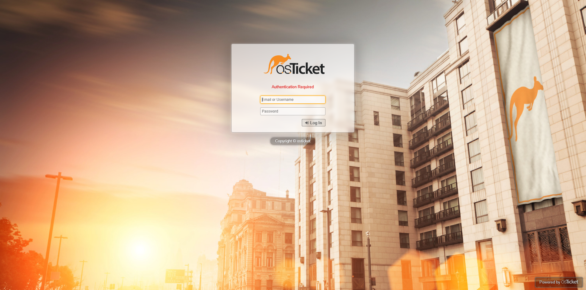

# osTikcet-Helpdesk-Deployment

## Objective
The osTicket Helpdesk Deployment project was created to build a cloud-based ticketing system using Microsoft Azure and Ubuntu Server. The goal was to deploy, configure, and secure an open-source IT service management platform in a virtual environment. This project demonstrates an understanding of server setup, network configuration, and web service deployment.

### Skills Learned
- Configuring and managing virtual machines in Microsoft Azure  
- Installing and maintaining a LAMP stack (Linux, Apache, MariaDB, PHP)  
- Managing databases and user privileges in MariaDB  
- Setting up and securing web applications with HTTPS and firewall rules  
- Working with Linux commands, SSH, and server permissions  
- Understanding IT service management workflows through osTicket deployment

### Tools Used
- Microsoft Azure  
- Ubuntu Server 22.04 LTS  
- Apache2 Web Server  
- MariaDB Database  
- PHP 8 and required modules  
- Certbot (for HTTPS configuration)  
- UFW (Uncomplicated Firewall)  

## Steps
1. Created a Microsoft Azure Virtual Machine running Ubuntu 22.04 LTS with inbound ports for SSH (22), HTTP (80), and HTTPS (443).  
2. Connected to the VM using SSH with an authentication key.  
3. Updated and upgraded system packages.  
4. Installed Apache, MariaDB, and PHP packages to build a LAMP stack.  
5. Secured and configured MariaDB, created the `osticket` database, and added a dedicated user with privileges.  
6. Downloaded and unzipped osTicket into the web directory, adjusted permissions for proper access.  
7. Configured an Apache virtual host file to serve the osTicket application.  
8. Copied and renamed configuration files, applied correct ownership and permissions.  
9. Completed web-based installation by connecting to the database and finalizing setup through the osTicket interface.  
10. Secured the installation by locking down the configuration file and removing the setup directory.  
11. Enabled HTTPS using Certbot and configured UFW firewall rules for additional security.  
12. Cleaned up unused Azure resources to prevent unnecessary costs. :contentReference[oaicite:1]{index=1}

## Screenshots

### osTicket End-User Portal

### osTicket Admin Login

